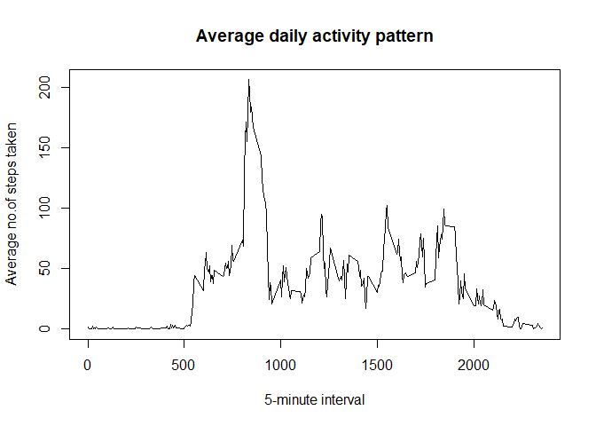

## Getting Data

```r
getwd()
```

```
## [1] "C:/Users/GuruJithin/Desktop/Coursera/UCI HAR Dataset/RepData_PeerAssessment1"
```

```r
ActivityData <- read.csv("C:/Users/GuruJithin/Desktop/Coursera/UCI HAR Dataset/RepData_PeerAssessment1/activity.csv")
```

## Preprocessing and understanding the data


```r
head(ActivityData)
```

```
##   steps       date interval
## 1    NA 2012-10-01        0
## 2    NA 2012-10-01        5
## 3    NA 2012-10-01       10
## 4    NA 2012-10-01       15
## 5    NA 2012-10-01       20
## 6    NA 2012-10-01       25
```

```r
tail(ActivityData)
```

```
##       steps       date interval
## 17563    NA 2012-11-30     2330
## 17564    NA 2012-11-30     2335
## 17565    NA 2012-11-30     2340
## 17566    NA 2012-11-30     2345
## 17567    NA 2012-11-30     2350
## 17568    NA 2012-11-30     2355
```

```r
dim(ActivityData)
```

```
## [1] 17568     3
```

```r
sum(is.na(ActivityData))
```

```
## [1] 2304
```

## Calculating the total number of steps taken

The first part of the question is to calculate the  total number of steps taken per day
1.1 We need to calculate the total number of steps taken per day.so we need to group by to similar dates and find the total number of steps.na.rm=TRUE is to remove NA values.The variable n1 filters the step values which is not equal to Zero.


```r
library(dplyr)
```

```
## 
## Attaching package: 'dplyr'
```

```
## The following objects are masked from 'package:stats':
## 
##     filter, lag
```

```
## The following objects are masked from 'package:base':
## 
##     intersect, setdiff, setequal, union
```

```r
stepsperday <- ActivityData %>%
        group_by(date) %>%
        summarise(steps=sum(steps,na.rm = TRUE))
```
The na values are removed but the values with zero are not removed.so i have extracted  the values which are not equal to zero by using filter function


```r
n1 <- filter(stepsperday,steps!=0)
head(n1)
```

```
## # A tibble: 6 x 2
##   date       steps
##   <chr>      <int>
## 1 2012-10-02   126
## 2 2012-10-03 11352
## 3 2012-10-04 12116
## 4 2012-10-05 13294
## 5 2012-10-06 15420
## 6 2012-10-07 11015
```
## To plot the histogram of total number of steps taken per day


```r
hist(n1$steps,main="Steps taken per day") 
```

<!-- -->

## Calculate the mean and median of n1
Calculating mean


```r
mean1 <- mean(n1$steps)
mean1
```

```
## [1] 10766.19
```

Calculating median


```r
median1 <- median(n1$steps)
median1  
```

```
## [1] 10765
```

The second part of the question is to calculate the Average daily activity pattern
2.1.To plot the time series plot we need to calculate the average number of steps taken per interval.In the main data we need to calculate the mean steps by grouping the intervals now.


```r
library(dplyr)
second <-ActivityData%>%
        group_by(interval)%>%
        
        summarise(steps=mean(steps,na.rm = TRUE))
head(second)   
```

```
## # A tibble: 6 x 2
##   interval  steps
##      <int>  <dbl>
## 1        0 1.72  
## 2        5 0.340 
## 3       10 0.132 
## 4       15 0.151 
## 5       20 0.0755
## 6       25 2.09
```

To do a time series we should call a plot with type="l"


```r
with(second,plot(interval,steps,type="l",xlab="5-minute interval",
                             ylab="Average no.of steps taken",main="Average daily activity pattern"))
```

<!-- -->

2.2.Which 5-minute interval, on average across all the days in the dataset, contains the maximum number of steps?
  For this we have to calculate by using which.max()
  

```r
valuemax<- second[which.max(second$steps),]$interval                                    #2.2
valuemax
```

```
## [1] 835
```

The third part of the question is imputing the missing values.There are a number of days/intervals where there are  missing values (coded as NA). The presence of missing days may introduce bias into some calculations or summaries of the data.
3.1.To calculate and report the total number of missing values as NA,we have to use sum of is.na() mv is a missing variable


```r
mv <- sum(is.na(ActivityData))
mv   
```

```
## [1] 2304
```
3.2.Devise a strategy for filling in all of the missing values in the dataset. The strategy does not need to be sophisticated. For example, you could use the mean/median for that day, or the mean for that 5-minute interval.
So we could use mean to fill the missing values in the steps.then zero values are removed by filtering the ActivityData


```r
ActivityData$steps[is.na(ActivityData$steps)] <- mean(ActivityData$steps,na.rm = TRUE)
n2 <- filter(ActivityData,steps!=0)
head(n2)
```

```
##     steps       date interval
## 1 37.3826 2012-10-01        0
## 2 37.3826 2012-10-01        5
## 3 37.3826 2012-10-01       10
## 4 37.3826 2012-10-01       15
## 5 37.3826 2012-10-01       20
## 6 37.3826 2012-10-01       25
```
3.3 To create a filled new data set with the original data set with a missing values as mean value,here(NA_filling).The fd(filled data) is created by aggregating steps by groupng dates.


```r
fd <- aggregate(steps~date,n2,sum)
head(fd)
```

```
##         date    steps
## 1 2012-10-01 10766.19
## 2 2012-10-02   126.00
## 3 2012-10-03 11352.00
## 4 2012-10-04 12116.00
## 5 2012-10-05 13294.00
## 6 2012-10-06 15420.00
```

3.4.To create a histogram,total number of steps per day ,mean and meadian values after imputing  and replaced with missing values.


```r
hist(fd$steps,main="steps per day after replacing NA")
```

<!-- -->

Now mean and median has to be calculated after replacing na values with mean values


```r
mean2 <- mean(fd$steps)

mean2
```

```
## [1] 10766.19
```

```r
median2 <- median(fd$steps)
median2
```

```
## [1] 10766.19
```
Both median and median of n1 is comparitively same as in the mean and median of n2 is 10766.19


4.1 Differences in activity patterns between weekdays and weekends? To work in dates we load the lubridate package.
we can use weekdays() to find a day is weekday or weekend.I have added one more column called whichday indicates weekday or weekend


```r
library(lubridate)
```

```
## 
## Attaching package: 'lubridate'
```

```
## The following objects are masked from 'package:base':
## 
##     date, intersect, setdiff, union
```

```r
datend <- as.Date(n2$date)               #4.1
chechweek <- n2%>%
        mutate(whichday= case_when(wday(datend) %in% 2:6 ~ "Weekday",
                                   wday(datend) %in% c(1,7) ~ "Weekend"))
head(chechweek)
```

```
##     steps       date interval whichday
## 1 37.3826 2012-10-01        0  Weekday
## 2 37.3826 2012-10-01        5  Weekday
## 3 37.3826 2012-10-01       10  Weekday
## 4 37.3826 2012-10-01       15  Weekday
## 5 37.3826 2012-10-01       20  Weekday
## 6 37.3826 2012-10-01       25  Weekday
```

4.2 To make a panel plot for interval and steps with whichday,we have to groupby interval and whichday,then calculate the total number of steps and summararise it


```r
avg <- chechweek%>%
        select(-date)%>%
        group_by(whichday,interval)%>%
        summarise(steps=sum(steps))
```

```
## `summarise()` has grouped output by 'whichday'. You can override using the `.groups` argument.
```

```r
head(avg)
```

```
## # A tibble: 6 x 3
## # Groups:   whichday [1]
##   whichday interval steps
##   <chr>       <int> <dbl>
## 1 Weekday         0  315.
## 2 Weekday         5  242.
## 3 Weekday        10  231.
## 4 Weekday        15  232.
## 5 Weekday        20  228.
## 6 Weekday        25  283.
```

4.2.After grouping and summarising we can make a panel plot by loading lattice package and make a time series plot with the layout as 2 row and 1 column as mentioned in the assignment


```r
library(lattice)

xyplot(steps~interval|whichday,data=avg,type="l",layout=c(1,2),facet=.~whichday,xlab="5min interval"
       ,ylab="Number of steps",main="Differences in pattern")
```

<!-- -->
